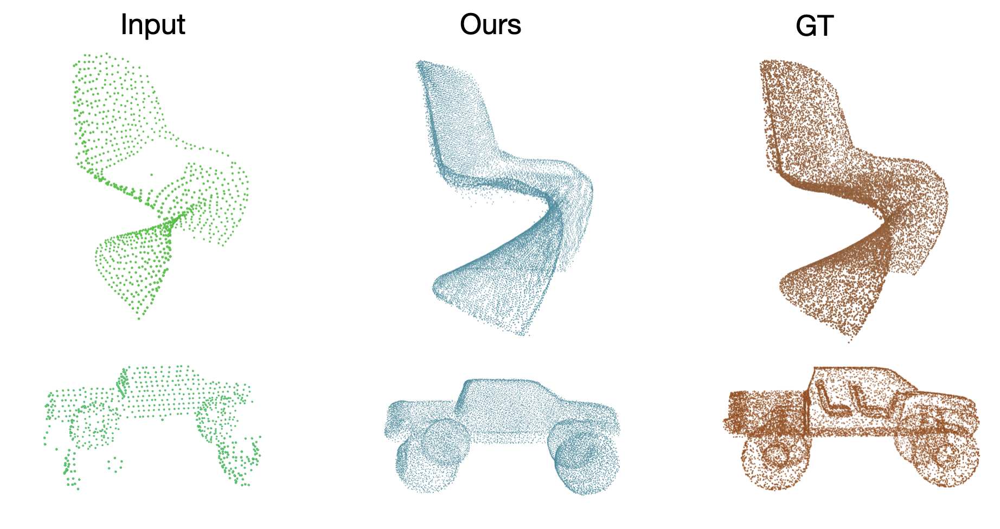

# Symm3dTri: TriPlane Symmetry-Guided Point Cloud Completion

<p align="center">
  
</p>

**Symm3dTri** is a point cloud completion network that combines tri-plane feature encoding with symmetry flow fields and symmetry-guided transformer refinement. Starting from a partial point cloud, it produces dense, high-fidelity completions at 16384 points via a coarse-to-fine two-stage pipeline.

---

## Results on PCN (ShapeNet)

| Metric | Value |
|--------|-------|
| Chamfer Distance L1 (×1000) | **6.632** |
| F-Score | **0.832** |

### Per-Category CDL1 (×1000)

| airplane | lamp | watercraft | table | chair | car | sofa | cabinet | **Avg** |
|----------|------|------------|-------|-------|-----|------|---------|---------|
| 3.764 | 5.162 | 5.743 | 6.033 | 6.974 | 7.687 | 8.761 | 8.943 | **6.632** |

---

## Qualitative Results

<p align="center">
  
</p>

*From left to right: partial input, Symm3dTri output, ground truth.*

---

## Architecture

The pipeline runs in two stages:

### Stage 1 — TriPlaneSymmetryNet (Coarse)

1. **PointNet++ SA-KNN Encoder** — Furthest Point Sampling to 512 keypoints, KNN grouping (k=16), MLP `[3→64→128]`, followed by a Positional Transformer and expanding MLP `[128→256→512]`. Global feature via max-pool: `(B, 512)`.
2. **TriPlane Generator** — Shared FC `Linear(512, 128×16)` seeds a `4×4` feature map, then three independent `ConvTranspose2d` chains upsample it to three orthogonal feature planes `T_xy, T_yz, T_zx` each of shape `(B, 128, 32, 32)`.
3. **TriPlane Sampler** — Keypoints are normalised to `[-1, 1]` and bilinearly sampled from each plane. Features are summed: `f_tri = f_xy + f_yz + f_zx` → `(B, 128, 512)`.
4. **Symmetry Flow Field** — Conv1d `128→256→128→3` predicts per-keypoint displacements `delta`. Symmetric counterparts: `sym_pts = keypoints + delta`. Coarse output: `cat[sym_pts, keypoints]` → `(B, 1024, 3)`.

### Stage 2 — SGFormer × 2 (Refinement)

A shared **local encoder** encodes `sym_pts` into symmetry features `(B, 128, 512)`. Two sequential SGFormer blocks refine the coarse output using **dual cross-attention fusion** — one cross-attention head fuses partial features, the other fuses symmetry features — followed by self-attention and per-point offset prediction.

| Block | Up-factor | Output |
|-------|-----------|--------|
| SGFormer-1 | ×2 | `(B, 2048, 3)` |
| SGFormer-2 | ×8 | `(B, 16384, 3)` |

**Total loss:**
```
L_total = CDL1(coarse, GT) + CDL1(fine1, GT) + CDL1(fine2, GT)
```

---

## Key Hyperparameters

| Parameter | Value |
|-----------|-------|
| Keypoints (SA output) | 512 |
| Plane channels | 128 |
| Plane resolution | 32 × 32 |
| Up-factors | [2, 8] → 1024 → 16384 |
| Global feature dim | 512 |
| Optimizer | AdamW (lr=2e-4, wd=5e-4) |
| Scheduler | WarmUpCosLR (warm=20, max=120) |
| Batch size | 32 |
| Epochs | 120 |

---

## Installation

```bash
git clone https://github.com/HarishValliappan/SymmCompletion.git
cd SymmCompletion
conda create --name Symm3dTri python=3.11.0
conda activate Symm3dTri
pip install torch==2.5.1 torchvision==0.20.1 torchaudio==2.5.1 --index-url https://download.pytorch.org/whl/cu118
pip install -r requirements.txt
sh build_extensions.sh
```

---

## Data Preparation

Download datasets and update the paths in `cfgs/dataset_configs/`:

| Dataset | Link |
|---------|------|
| PCN (ShapeNet) | [download](https://gateway.infinitescript.com/s/ShapeNetCompletion) |
| MVP | [download](https://drive.google.com/drive/folders/1ylC-dYFM45KW4K9tPyljBSVyetazCEeH?usp=sharing) |
| ShapeNet55/34 | [download](https://drive.google.com/file/d/1jUB5yD7DP97-EqqU2A9mmr61JpNwZBVK/view) |

Update the config paths:
```yaml
# PCN
PARTIAL_POINTS_PATH: <your_path>/%s/partial/%s/%s/%02d.pcd
COMPLETE_POINTS_PATH: <your_path>/%s/complete/%s/%s.pcd

# ShapeNet55/34
PC_PATH: <your_path>/shapenet_pc
```

---

## Training

```bash
# PCN
python main.py --config cfgs/PCN_models/SymmCompletion.yaml \
               --val_freq 10 --val_interval 50 \
               --exp_name train_pcn --deterministic

# ShapeNet55
python main.py --config cfgs/ShapeNet55_models/SymmCompletion.yaml \
               --val_freq 10 --val_interval 50 \
               --exp_name train_sn55 --deterministic
```

## Testing

```bash
python main.py --config cfgs/PCN_models/SymmCompletion.yaml \
               --test --test_interval 50 \
               --ckpt ./ckpts/PCN/ckpt-best.pth \
               --exp_name test_pcn
```

---


## Acknowledgements

This work is built on top of the following projects:

- **[SymmCompletion (original, AAAI 2025)](https://github.com/HongyuYann/SymmCompletion)** — Hongyu Yan et al., *SymmCompletion: High-Fidelity and High-Consistency Point Cloud Completion with Symmetry Guidance*
- [AnchorFormer](https://github.com/chenzhik/AnchorFormer)
- [PoinTr](https://github.com/yuxumin/PoinTr)
- [PointNet++](https://github.com/erikwijmans/Pointnet2_PyTorch)
- [SnowflakeNet](https://github.com/AllenXiangX/SnowflakeNet)
- [PCN](https://github.com/wentaoyuan/pcn)
- [GRNet](https://github.com/hzxie/GRNet)
- [VRCNet](https://github.com/paul007pl/VRCNet/tree/main)

---

## Citation

If you use SymmCompletion in your work, please cite the original paper:

```bibtex
@inproceedings{yan2025symmcompletion,
    title={SymmCompletion: High-Fidelity and High-Consistency Point Cloud Completion with Symmetry Guidance},
    author={Yan, Hongyu and Li, Zijun and Luo, Kunming and Lu, Li and Tan, Ping},
    booktitle={Proceedings of the AAAI Conference on Artificial Intelligence},
    volume={39},
    number={9},
    pages={9094--9102},
    year={2025}
}
```
